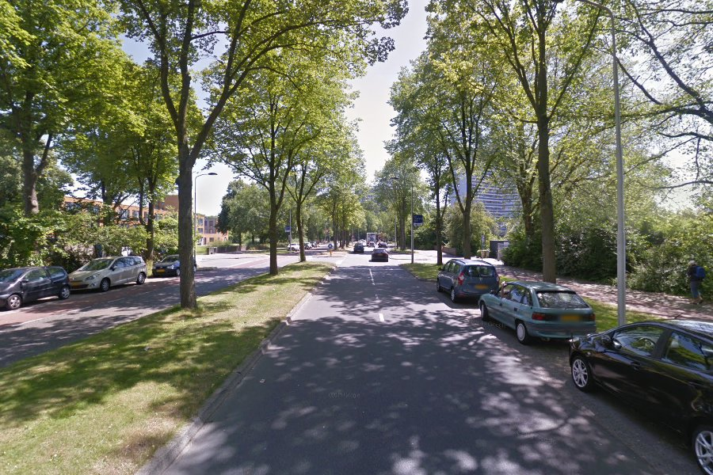
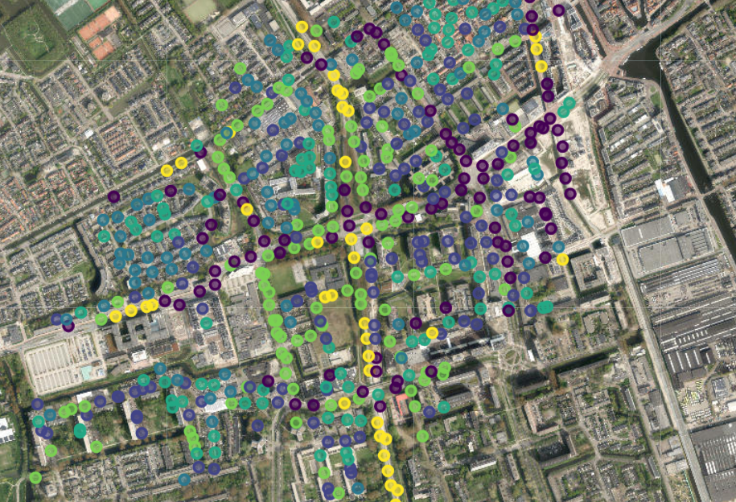

# Streetscapes

Streets are classified based on their role in vehicle movement (Su et al., 2022), considering factors like lane number and width, vehicle speed, and type. However, this approach often overlooks the street's context and its function as a social space. Alternative classification methods that integrate both "movement" and "place" aspects are needed. With advancements in deep learning and access to millions of street view images, there is potential to enhance street classification. Images provide richer information than numerical databases, and deep learning models can analyze them more quickly than field observations. 

> <B>Project Objective:</B> To classify street typologies in Delft 
> The primary objective of this project is to create a deep learning model that can automatically classify street typologies by analyzing computer vision embeddings. This aims to be solved via unsupervised and transfer learning, this approach allows to not rely on labeled data. Making the model simpler and transferable.
 
|  | |
|-------------------------------------------------------------------|------------------------------------------------------------------|
| **Figure 1:** Building damage due to subsidence effects           | **Figure 2:** Building damage due to subsidence effects          |

## 📊 Results

To be written...

## 🏗️ Module Structure

The repo is split into two submodules:

### 🏙️ `streetscapes.models`

- `vit.py`: Transfer learning ImageNet Vision transformer without classifier for feature extraction 
- **Dimensionality reduction**: Two reduction models:
  - `pca.py`: Principal Component Analysis
  - `vae.py`: Variational Auto Encoder (Encoder Only)
- **Classifiers**: Two unsupervised classification models:
  - `km.py`: KMeans classifier
  - `gm.py`: Guassian Mixture

### 🔧 `streetscapes.processing`

- Scripts neccessary to process the images, analyse the features, and plot the data

## 🔧 Requirements

